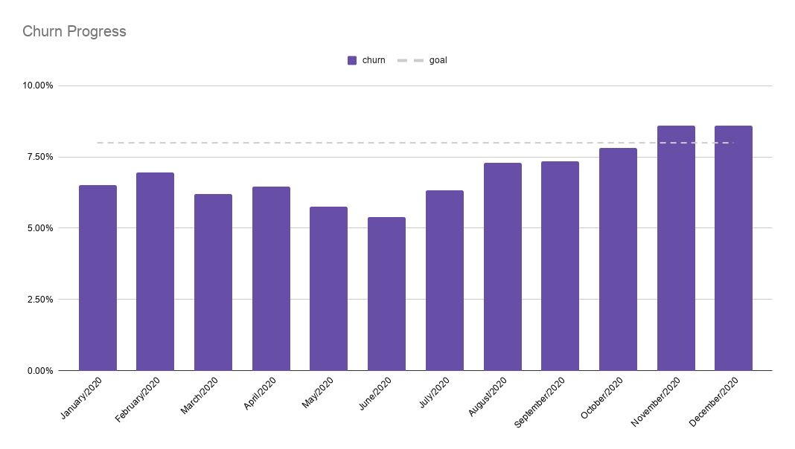

# Technical Case - BI/Analytics

## Context

Petlove is the largest pet-oriented platform in Latin America. Taking care of the entire experience of the pet parent, since supplying products (via e-commerce [here](https://www.petlove.com.br/)), together with the veterinarian's care (by [Vet Smart](https://www.vetsmart.com.br/)), ensuring an ERP and adequate management system (by [Vetus](https://vetus.com.br/)) or providing services such as pet sitter and others (by [DogHero](https://www.doghero.com.br/)).

Because of this very diverse scenario, the Data area of the Petlove group created squads with people who have different skills to help each business front to have better deliveries.

Your challenge will be to participate in the **Subscription team**: a service that the parent of a pet hires a set of items to receive as often as he wishes, paying a subscription in the period selected by the client (and receiving a discount when hiring the service).

## The problem

The subscription team has a goal to reduce subscriber churn. It is important to note that the definition of what we are calling **churn** is any user who hired Petlove's subscription service and canceled it after hiring. 

When analyzing data from the last few months, despite all the usability improvements on the platform, churn has been increasing. Here is the chart to exemplify:

In the graph, the bar represents the relative number of users who canceled the subscription in the respective month. The dashed line is the goal of the subscription team in which you are inserted. An example to clarify the calculation: in October/2020 of 1,000 subscribers in the base, 75 of them canceled their subscription.

Your job will be **to present a final result with TWO main points: Learnings and Next Steps**. Remember that the insights need to be clear to everyone, from the director of the area to the technology team that will see your presentation.

## Tools

Here are the tools we use and SUGGEST you to use to continue in this process:

1. **Python/Jupyter Notebooks/SQL** ⇒ when code is required;
2. **PowerPoint/Google Slides** ⇒ to present the results to the external team;
3. **GitHub** ⇒ as a repository to store the codes and some - small - documentation. 

## Materials

The data engineering team provided a **SAMPLE** within an csv with the most useful data for you ([link here](data-test-analytics.csv)). This material will be enough for you to get the necessary insights, following the structure:

| Column             | Description                                                           |
|--------------------|-----------------------------------------------------------------------|
| id                 | User ID                                                               |
| created_at         | Creation date of the subscription                                     |
| updated_at         | Date the subscription was last updated                                |
| deleted_at         | Date when the subscription was canceled / deleted                     |
| name_hash          | Username, encrypted                                                   |
| email_hash         | User email, encrypted                                                 |
| address_hash       | User address, encrypted                                               |
| birth_date         | User birthday                                                         |
| status             | Subscription status                                                   |
| version            | Subscription version released                                         |
| city               | User city                                                             |
| state              | User state                                                            |
| neighborhood       | User neighborhood                                                     |
| last_date_purchase | Date of last purchase made by subscription                            |
| average_ticket     | The average value of the user for each order                          |
| items_quantity     | The average number of items that the user usually signs               |
| all_revenue        | Total user-generated revenue in subscription                          |
| all_orders         | Total user-generated orders in subscription                           |
| recency            | How many days have passed since the user's last purchase, in recency. |
 

## Final delivery

What you are expected to deliver within the test period:

1. **Codes:** whether in python/notebook or SQL, to understand how graphics and insights were calculated;
2. **Technical documentation:** preferably a simple README with markdown, to explain the code logic in more detail;
3. **Final presentation**: can be in PDF or PPTX format, with all the insights to solve this case.

The **criteria for evaluation** will be:

1. **Storytelling/Rhetoric:** How easy was it for you to explain the concepts? Were the insights explicit and the results of the analysis clear after the presentation?
2. **Quality of your code:** evaluate the performance and ease of reading/understanding the content. Some references for us are: For code in general ([here](https://www.amazon.com/Clean-Code-Handbook-Software-Craftsmanship/dp/0132350882)), for python itself ([here](https://google.github.io/styleguide/pyguide.html)), and for the SQL itself ([here](https://about.gitlab.com/handbook/business-ops/data-team/platform/sql-style-guide/));
3. **Documentation:** does the material have clear documentation of how you arrived at the calculations? A suitable README to explain the analysis or final results? Remembering that it is important to have TECHNICAL documentation to understand the code and, if someone from another squad sees your material, they can follow your steps to reach the same results;
4. **Visualization:** easy to understand graphics, with explicit axes and learned in the material to simplify the understanding of the business team. Remembering that design will not be evaluated in the ARTISTIC sense, but if it is functional for analysis, without hindering understanding;
5. **Next Steps:** Are the necessary actions to be taken after the analysis is complete useful? And do they solve the pain of the business team? Were the next steps clear for everyone during the presentation?

**IMPORTANT:** No statistical model of churn forecast will be evaluated. If you want to produce something, feel free. But PRIORITY will be the analysis and the final material for the business/product team.
